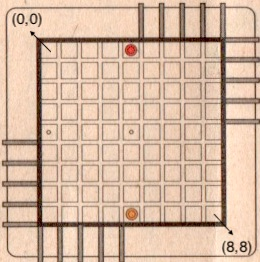
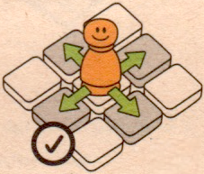
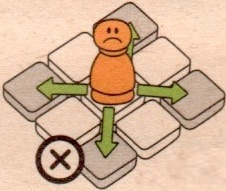
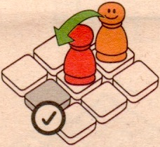
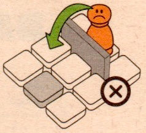
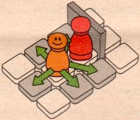
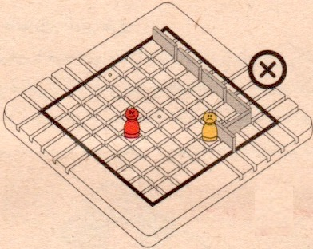

# Quoridor

## What is Quoridor?
Quoridor is a 2 or 4 players board game which whose board consists of 81 square pieces (9x9). Each player is represented by a pawn which begins at the center space of one edge of the board. Besides, there are 20 walls that will be divided equally among the players at the start of the game, and once placed, cannot be moved or removed.

The objective is to be the first player to move their pawn to any piece on the opposite side of the game board from which it begins.

## What are the rules?
1. Pawns can only move in 4 main directions (but not diagonally) 

 

2. If adjacent to another pawn, the pawn may jump over that pawn

3. Pawns can't jump over the wall

4. If an adjacent pawn has a third pawn or a wall on the other side of it, the player may move to either space that is immediately adjacent (left or right) to the first pawn

5. The walls should be placed in a way that there remains at least one path that any pawn can use to reach the other side of the board

## How to run?

### Python
1. Clone the repository:

	`git clone https://github.com/behzadshomali/Quoridor.git`
    
2. Go to the cloned directory and then *python* sub-directory:

	`cd Quoridor/python/`
    
3. Run the program:

	`python3 main.py`
	
    
### Java
1. Clone the repository:

	`git clone https://github.com/behzadshomali/Quoridor.git`
	
2. Go to the cloned directory and then *python* sub-directory:

	`cd Quoridor/java/`
	
3. compile the file:

	`javac Player.java Piece.java Board.java MiniMaxPlayer.java Main.java`
	
4. Run the program:

	`java Main`
